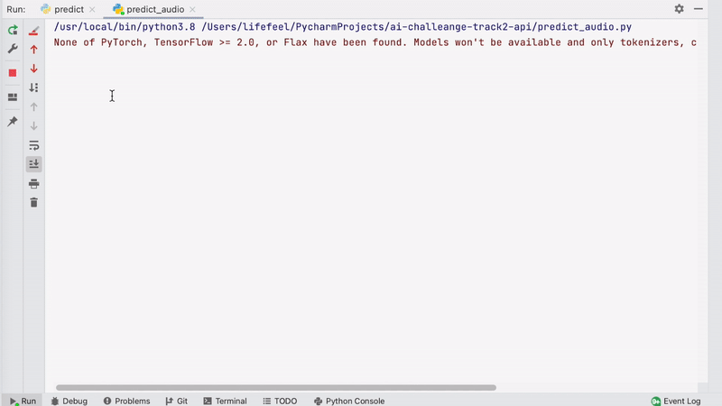

# 인공지능 그랜드 챌린지 4차 대회 2단계 트랙2

그랜드 챌린지 4차 대회 2단계에서 수행했던 모델을 공개합니다. 리더보드에서 가장 높은 성적을 보였던 모델을 API 버전으로 제작하였습니다.

## Requirements

* Python >= 3.6

### Git LFS

모델파일과 샘플데이터를 받기 위해서는 Git LFS가 필요합니다. 없을 경우 아래 링크를 이용해 설치합니다.

* [Git LFS Installation](https://github.com/git-lfs/git-lfs/wiki/Installation)

## Installation

* 아래 명령을 이용해 소스코드를 받습니다.

    ```
    https://github.com/sogang-isds/ai-challenge-4th-round-2nd-track2.git
    ```

* Git LFS가 자동으로 되지 않을 경우 아래 명령을 이용해 LFS 파일들을 내려받습니다.

    ```bash
    cd ai-challenge-4th-round-2nd-track2
    git lfs pull
    ```

* Python 가상환경을 설치합니다.

    ```bash
    cd ai-challenge-4th-round-2nd-track2
    virtualenv -p python3 myenv
    source myenv/bin/activate
    ```

* Python 패키지를 설치합니다.

    ```bash
    pip install -r requirements.txt
    ```

## 분류

협박은 아래와 같이 5가지의 클래스로 분류됩니다.

- 000001 : 일반대화
- 020121 : 협박
- 02051 : 갈취 또는 공갈
- 020811 : 직장 내 괴롭힘
- 020819 : 기타 괴롭힘

## 실행

### 텍스트 추론 

- 아래와 같이 실행합니다.

  ```bash
  python predict.py
  ```

- 실행을 하면 아래와 같이 프롬프트가 나타나며, 여기에 샘플 텍스트를 입력합니다.

  ```
  INPUT> 지금 머하자는 거지 이런식으로 나오겠다는 건가 죄송합니다 이딴 식으로 계속나오면 너 죽여버리겠어 죽기 싫으면 앞으로 시키는 대로 무조건 해야 할거야 죄송합니다 이 새끼 말로만 하지 말고 행동으로 하란 말이야 네 죄송합니다 알겠으면 꺼져 지금 당장
  ```

- 결과로 클래스 분류코드와 폭력 분류명이 출력됩니다. 

  ```
  020121, 협박
  ```

### 오디오 추론

오디오 추론에서는 샘플 오디오파일을 분할 및 음성인식 후 텍스트 추론단계를 거쳐 결과를 출력합니다.

- 아래와 같이 실행합니다.

  ```
  python predict_audio.py
  ```

- 실행을 하면 아래와 같이 프롬프트가 나타나며, 여기에 샘플 데이터 경로를 입력합니다.

  ```
  파일 경로를 입력하세요.
  INPUT> sample_data/t2_0001.wav
  ```

- 실행 결과는 아래와 같습니다.

  

  ```
  Audio splitting...
  splitted : ./tmp/chunk_000.wav, 0.00 - 3.29
  splitted : ./tmp/chunk_001.wav, 3.29 - 9.21
  splitted : ./tmp/chunk_002.wav, 9.21 - 14.36
  splitted : ./tmp/chunk_003.wav, 14.36 - 15.80
  splitted : ./tmp/chunk_004.wav, 15.80 - 18.70
  splitted : ./tmp/chunk_005.wav, 18.70 - 19.87
  splitted : ./tmp/chunk_006.wav, 19.87 - 21.81
  splitted : ./tmp/chunk_007.wav, 21.81 - 23.46
  splitted : ./tmp/chunk_008.wav, 23.46 - 26.50
  splitted : ./tmp/chunk_009.wav, 26.50 - 28.36
  splitted : ./tmp/chunk_010.wav, 28.36 - 30.75
  splitted : ./tmp/chunk_011.wav, 30.75 - 32.02
  splitted : ./tmp/chunk_012.wav, 32.02 - 33.74
  splitted : ./tmp/chunk_013.wav, 33.74 - 36.49
  splitted : ./tmp/chunk_014.wav, 36.49 - 38.47
  
  Speech recognizing...
  recognized :./tmp/chunk_000.wav, 지금 뭐 하자는 거야
  recognized :./tmp/chunk_001.wav, 죄송하면 다야 이런 식으로 나오겠다는 거야
  recognized :./tmp/chunk_002.wav, 이딴 식으로 계속 나오면 진짜 내가 너
  recognized :./tmp/chunk_003.wav, 죽여버릴 거야
  recognized :./tmp/chunk_004.wav, 죽기 싫으면 앞으로 시킨 대로
  recognized :./tmp/chunk_005.wav, 무조건
  recognized :./tmp/chunk_006.wav, 해야 할 것
  recognized :./tmp/chunk_007.wav, 죄송합니다
  recognized :./tmp/chunk_008.wav, 아 참이 새끼 죄송하다고 만 하지 말고
  recognized :./tmp/chunk_009.wav, 좀 제발 좀
  recognized :./tmp/chunk_010.wav, 행동 으로 좀 하란 말이야
  recognized :./tmp/chunk_011.wav, 죄송합니다
  recognized :./tmp/chunk_012.wav, 행동으로
  recognized :./tmp/chunk_013.wav, 알았으면 빨랑 꺼져
  recognized :./tmp/chunk_014.wav, 지금 당장
  
  Predicting...
  020121, 협박
  ```

## Examples

분석하고자 하는 음성파일을 API를 통해 보내면 분석 후 클래스 코드를 리턴합니다. 예제 음성대화 파일은 `sample_data` 디렉토리에 있습니다.

**api_example.py**

```python
import requests

url = 'http://163.239.28.23:5001/api/get_threat_result'

wav_file = 'sample_data/t2_0001.wav'
file_data = {'file': ('t2_0001.wav', open(wav_file, 'rb'), 'audio/wav')}
resp = requests.post(url, files=file_data)

if resp.status_code == requests.codes.ok:
    response_body = resp.content.decode('utf-8')
    print(response_body)
else:
    print('Error :', resp.status_code)
```

파이썬 버전의 예제코드를 돌리려면 아래 명령을 입력합니다.

```bash
python api_example.py
```

실행 결과로는 아래와 같이 JSON 형태로 받아보실 수 있습니다.

```json
{
  "code": "E000", 
  "data": {
    "annotations": [
      {
        "class code": "020121", 
        "file_name": "t2_0001.wav"
      }
    ]
  }, 
  "msg": "Success"
}
```

## 응답 데이터

### code

- E000 : 성공


## Copyright

본 프로젝트는 공개소프트웨어를 이용하여 개발하였으나, 데이터 처리 방법 및 모델 구현 등에 대한 저작권은 [서강대학교 지능형 음성대화 인터페이스 연구실](https://isds.sogang.ac.kr/)에 있습니다.

